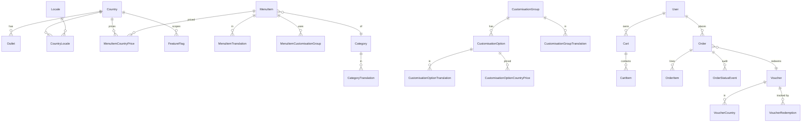

# Baskbear Coffee — Mobile App Redesign

> **Loob Holding Sdn Bhd — Lead Full Stack Developer Assessment**
> Candidate: Chris Cheng · Submission: May 2026

A cross-platform mobile app redesign for **Baskbear Coffee**, delivered as a Flutter app backed by a NestJS + MySQL API, with an AWS multi-region deployment blueprint.

This README is self-contained: all 17 assessment questions are answered in full below (§3 Design & UX, §4 Database Design, §5 AWS Architecture). The rendered ER and AWS topology diagrams live in [`docs/`](docs/).

---

## App Overview

Baskbear Coffee operates across Malaysia and Thailand and serves millions of customers. This submission reimagines its mobile ordering experience around four pillars: **fast browsing**, **frictionless ordering**, **local relevance** (currency, language, tax, outlets), and **trustworthy promotions** (voucher rules customers can predict).

| Module        | What ships                                                                                              |
| ------------- | ------------------------------------------------------------------------------------------------------- |
| Menu          | ✅ Full — category browsing, multi-language, country pricing, customisation, dietary tags               |
| Ordering      | ✅ Full — cart, checkout, idempotent placement, history, status timeline, peak-load design              |
| Vouchers      | ✅ Listing, validation API, redemption wired through checkout (with a non-stackable policy, justified)  |
| Multi-Country | ✅ MY + TH + SG, JSON-driven country onboarding (see [§4 Q8](#q8-how-does-your-schema-handle-multi-country-data)), in-session country switcher |

Per the assessment brief, depth is prioritised on Menu + Ordering (where engineering trade-offs are most interesting). Vouchers and Multi-Country are functional but lighter on UX polish.

---

## Tech Stack

| Layer            | Technology                                          | Justification (short)                                                                                                                       |
| ---------------- | --------------------------------------------------- | ------------------------------------------------------------------------------------------------------------------------------------------- |
| Frontend         | Flutter 3.38 + Riverpod 2 + go_router               | Single codebase iOS+Android+Web; Riverpod's compile-safe DI fits a feature-modularised codebase; go_router gives deep-linkable URLs.       |
| On-device AI     | flutter_gemma (Gemma 3 1B) + speech_to_text + flutter_tts + Open-Meteo | "AI Barista" tab — an offline LLM that recommends from the live menu, with voice in/out and weather+mood awareness. Keyless weather; a deterministic keyword recommender is the fallback so it works with no model/network. See [§3.1 Q3](#q3-optional-what-additional-features-did-you-build-beyond-the-four-required-modules-and-why). |
| Backend          | NestJS 11 (TypeScript) + Prisma 7 + Zod             | Modular DI / decorators give a clean architectural showcase; Prisma 7's driver-adapter pattern (no Rust query engine) trims runtime + cold-start; Zod adds runtime input validation. |
| Database         | MySQL 8 (Aurora MySQL in prod)                      | Required. Aurora gives multi-region read replicas + Global Database for cross-region failover.                                              |
| Auth             | AWS Cognito (User Pools, Hosted UI)                 | Hosted UI removes auth UI work; MFA + social-login ready; JWT verified by API via JWKS; fits the AWS theme. Dev bypass for local review.    |
| Cloud            | AWS — ECS Fargate, Aurora, ElastiCache, S3+CloudFront | See [§5 AWS Architecture](#5-aws-architecture--scalability).                                                                               |
| Version Control  | GitHub                                              | This repo (`baskbear-assessment`).                                                                                                          |

---

## Repository Structure

```
baskbear-assessment/
├── README.md                       ← you are here (full Q1–Q17 answers)
├── docker-compose.yml              ← local MySQL 8 + Redis (one command)
├── docs/
│   ├── architecture.md             ← rendered ERD + AWS topology diagrams
│   ├── aws-architecture.png        ← rendered topology
│   ├── aws-architecture.mmd        ← Mermaid source
│   ├── erd.png                     ← rendered ER diagram
│   └── erd.mmd                     ← Mermaid source
├── apps/
│   ├── api/                        ← NestJS API + Prisma
│   │   ├── prisma/                 ← schema, migrations, seed
│   │   ├── src/                    ← feature-modular Nest code
│   │   ├── .env.example
│   │   └── package.json
│   └── mobile/                     ← Flutter app (iOS/Android/web)
│       ├── lib/                    ← feature-modular Dart code
│       ├── test/                   ← unit + widget tests
│       ├── .env.example
│       └── pubspec.yaml
├── db/sql/                         ← raw SQL export of the Prisma migration
└── .github/workflows/              ← api-ci.yml + mobile-ci.yml
```

---

## Local Setup

### Prerequisites

- Flutter 3.38+ (tested on 3.38.3)
- Node.js 20+ (Node 25 tested)
- Docker / OrbStack (for MySQL via the included `docker-compose.yml`)
- Xcode (iOS sim) or Android Studio (emulator) or Chrome (web)

### 1. Start MySQL

```bash
docker compose up -d                     # exposes MySQL 8 on :3307, Redis on :6379
```

The bundled compose file uses known credentials (`baskbear:baskbear@localhost:3307/baskbear`) so the `.env.example` "just works".

### 2. Backend (apps/api)

```bash
cd apps/api
cp .env.example .env                     # tweak only if you skipped docker compose
npm install                              # postinstall: prisma generate (Prisma 7 emits to src/generated/prisma)
npx prisma migrate deploy
npm run seed                             # populates MY + TH + SG menus, 6 outlets, 3 vouchers
npm run start:dev                        # http://localhost:3000
```

Smoke checks:

```bash
curl http://localhost:3000/health
curl -H "X-Country: MY" http://localhost:3000/v1/menu | jq '.[0]'
curl -H "X-Country: TH" http://localhost:3000/v1/menu | jq '.[0]'
curl -H "X-Country: SG" http://localhost:3000/v1/menu | jq '.[0]'
```

> **Adding a new country.** Edit `apps/api/prisma/seed-data/*.json` (countries, pricing, vouchers, feature flags) and re-run `npm run seed`. No code changes needed — the seeder validates that every SKU has a price for every country before touching the DB. Full runbook in [§4 Q8](#q8-how-does-your-schema-handle-multi-country-data).

A demo user `demo@baskbear.test` is seeded. In dev (`DEV_AUTH_BYPASS=true`, the default in the example env) the API accepts `Authorization: Bearer dev:demo-user-sub` instead of validating against Cognito's JWKS — so reviewers don't need AWS credentials.

### 3. Mobile (apps/mobile)

```bash
cd apps/mobile
cp .env.example .env
flutter pub get
flutter run                              # picks the first available device
```

The Flutter code targets **iOS, Android, and Chrome**. Pick whichever device works for you:

- `flutter run -d chrome --web-port 5050` — fastest first run, no toolchain setup beyond Chrome.
- `flutter run -d <ios-sim-udid>` — when you have an iOS Simulator runtime matching your installed Xcode SDK.
- `flutter run -d <android-emu-name>` — Android emulator (use `API_BASE_URL=http://10.0.2.2:3000` in `.env`).

#### Enabling the on-device AI Barista LLM (optional)

The **Barista** tab works with zero setup via an offline, weather/mood-aware
keyword recommender. To run the real on-device LLM (Gemma 3 1B via
[`flutter_gemma`](https://pub.dev/packages/flutter_gemma)):

1. Sign in to HuggingFace and **accept the Gemma licence** on the
   [model page](https://huggingface.co/litert-community/Gemma3-1B-IT).
2. Create a **read token** at <https://huggingface.co/settings/tokens>.
3. In `apps/mobile/.env`, set `HUGGINGFACE_TOKEN=<your token>`. `GEMMA_MODEL_URL`
   already defaults to `gemma3-1b-it-int4.task` (~555 MB).
4. **Fully restart** the app (`.env` is a bundled asset read once at startup),
   open the Barista tab, and tap **Enable AI** to download (cached afterwards).

**On-device inference only runs reliably on a physical device** — emulators and
the iOS Simulator fall back to the keyword recommender (see
[Known Limitations](#known-limitations--what-i-would-improve)). `.env` is bundled
into the app binary, so never commit a real token (it's gitignored here).

### 4. Tests

```bash
cd apps/api && npm test                  # 8 unit tests covering pricing + voucher rules
cd apps/mobile && flutter test           # 35 tests: money formatter, DTO parsing, country resolution,
                                         # AI Barista recommender + weather/mood context, Lottie widgets
```

CI runs the same on every push (`.github/workflows/api-ci.yml`, `mobile-ci.yml`).

---

# 3. Design & Architecture Justification

## 3.1 App Design & UX

### Q1. Why did you design the app this way? Walk us through your design philosophy.

**Three product principles drove every UX decision.**

1. **The fastest path to ordering is sacred.** A returning customer should be
   able to reorder a usual drink in under 4 taps from cold launch. The bottom
   nav puts *Menu* first; the menu opens directly on category tabs (no carousel
   hero blocking content); items pre-load their customisation panel; and the
   cart sits one tab away. We resist anything that delays the first scroll —
   no full-screen splash, no "What's new?" interstitial.

2. **Pricing and promotions must be predictable.** Customers churn from food &
   beverage apps because they don't trust the bill. Every price the user sees
   is the final price for that customisation in their country — recomputed live
   as they select size/milk/sugar (`menu_item_detail_screen.dart:43`). The
   voucher panel at checkout shows discount, tax, and total as separate
   line-items so there are no surprises (`checkout_screen.dart:_SummaryRow`).

3. **Local feel beats global feel.** A Baskbear customer in Bangkok should see
   the menu in Thai with THB prices, not English with MYR mentally converted.
   On first launch the app **auto-detects the country from device location**
   (GPS → reverse-geocode, with a device-region fallback) and skips onboarding
   entirely when it lands on a supported country (`onboarding_screen.dart`,
   `core/location/location_service.dart`); the manual picker only appears when
   detection is denied/unavailable or resolves to a country we don't operate
   in. The whole API surface is then scoped via `X-Country` / `X-Locale`
   headers (`api_client.dart:33`). The country chip in the top right of the
   menu doubles as a signpost: "you are seeing Malaysian content".

**Information architecture**: 5 tabs (Menu, Cart, Orders, Offers, Account)
deliberately mirror what a barista cares about: what to order, where my order
is, what's on sale. Account is last because most sessions don't need it.

### Q2. How did you approach multi-country UX? What decisions did you make for localisation and regionalisation?

Multi-country is treated as a **first-class data axis**, not a translation
afterthought. Four concrete choices:

- **Region is detected, not asked, where possible.** On first launch the app
  reads device location (GPS → reverse-geocode to an ISO country code, falling
  back to the device's configured region) and resolves it to a supported
  country + locale (`core/location/location_service.dart`,
  `resolveCountrySelection` in `country_controller.dart`). Locale prefers the
  device language when the country supports it, else the country default. A
  detected, supported country skips the onboarding picker outright; anything
  unsupported or undetectable falls back to manual selection. Country detection
  is best-effort — a denied permission never blocks the user.
- **Country is a property of every priced row.** `menu_item_country_prices`
  and `customisation_option_country_prices` exist so we never need to "convert"
  prices at request time — we look up exact integers. This dodges the
  rounding bugs other apps ship when MYR→THB is done via float multiplication.
- **Locale is country-scoped.** A Malaysian user can pick `en` or `ms`; a
  Thai user gets `en` or `th`. Forcing locale to be a subset of country in the
  schema (`country_locales`) means we can't ship a UI where someone selects
  Bahasa Malaysia in Thailand by accident.
- **Currency formatting is country-driven, not locale-driven.** A Malaysian
  customer reading the English UI still sees `RM 18.50`, not `$ 18.50`. The
  Flutter helper `formatMoney` takes the currencyCode independently from the
  Dart locale (`core/money.dart:7`).

**Concrete UX deltas between MY and TH in the seeded data**:
- Different tax (MY 6% SST vs TH 7% VAT) — visible on the checkout summary.
- Different vouchers (`MY5OFF` only valid in MY).
- Different oat/soy milk surcharge (TH pays more — modelled via
  `customisation_option_country_prices`).
- Delivery enabled in MY only (via `feature_flags`).

**Switching country mid-session** invalidates the menu, cart, orders, and
voucher caches at once (`account_screen.dart:_switchCountry`) so the user
never sees stale MYR prices on the next screen.

### Q3. [Optional] What additional features did you build beyond the four required modules, and why?

Three intentional extras:

- **Feature flags table + endpoint.** Real multi-country rollouts need per-region
  kill-switches. The schema models them (`feature_flags`) and the API exposes
  `GET /v1/countries/feature-flags?country=MY`. Cost: a few hours.
  Value: any future feature (delivery, kiosk pairing, payment method) gets a
  country toggle without a deploy.
- **Idempotency on order placement.** Not technically required, but every
  high-traffic ordering system needs it: a flaky cellular connection retries
  the same POST, and without idempotency keys you'd double-charge a customer.
  Implemented end-to-end (client generates UUID v4 →
  `orders_repository.dart:31`, server enforces unique
  `(userId, idempotencyKey)` → `orders.service.ts:place`).
- **AI Barista (on-device LLM + speech).** A conversational "what should I drink?"
  assistant in its own bottom-nav tab (`features/ai_barista/`). It's grounded in
  the *real* country menu — it fetches the same `GET /v1/menu` the menu screen
  uses, so recommendations are always live SKUs at the right localised price,
  never hallucinated (a guardrail drops any item not on the menu). It's also
  **context-aware**: a row of mood chips (Boost / Relax / Focus / Treat / Cosy)
  plus the current weather (keyless [Open-Meteo](https://open-meteo.com), by
  country city — no GPS prompt) bias *both* the LLM prompt and the offline
  recommender — pick *Cosy* on a rainy day and it leans warm; *Boost* when it's
  hot and it leans iced and strong (and you can get a suggestion from a mood chip
  alone, no typing). Two AI services:
  an **on-device LLM** via [`flutter_gemma`](https://pub.dev/packages/flutter_gemma)
  (Gemma 3 1B, no API key, runs offline) and **speech** — voice input via
  `speech_to_text` and read-aloud replies via `flutter_tts`. Because on-device LLM
  inference only runs reliably on physical hardware, the tab also ships a
  deterministic keyword recommender so it works everywhere with zero setup; the
  Gemma model is an opt-in upgrade (see Known Limitations). No backend changes —
  the feature is entirely client-side.

## 3.2 Flutter Architecture

### Q4. Which state management solution did you choose and why? What trade-offs did you accept?

**Riverpod 2 (`flutter_riverpod`)**, with `Provider`, `FutureProvider`,
`AsyncNotifierProvider`, and family providers.

**Why over BLoC**: BLoC is excellent for tightly-eventful domains (chat,
streaming) but adds boilerplate (events, states, mappers) that drags on a
CRUD-shaped app where most screens are "fetch, display, mutate". Riverpod's
compile-safe DI (`ref.watch` / `ref.read`) gives us the parts of BLoC that
matter (testability, separation, immutability) without the ceremony.

**Why over GetX**: GetX co-mingles state, navigation, and DI, and its global
service locator pattern is hard to defend at code review. Riverpod's explicit
graph makes lifecycle and dependencies inspectable.

**Trade-offs accepted**:
- Slightly more verbose than `setState`-style code for trivial screens — we
  pay this cost because the *non-trivial* screens (cart, checkout, country
  switch) benefit massively.
- Riverpod's 3.x major versioning is moving fast — we pin and
  test before bumps.
- Code generation (`riverpod_generator`) was attempted but conflicted with
  Riverpod 3 on this Dart SDK; we use the manual Provider syntax instead. The
  same testability story applies either way.

### Q5. How did you structure your Flutter project? Describe your folder structure and layer separation.

Feature-modular with strict layering. Concrete tree:

```
lib/
├── main.dart                     ← entrypoint: load .env, ProviderScope, run app
├── app/                          ← root MaterialApp, router, theme, shell
│   ├── app.dart
│   ├── router.dart               ← go_router config
│   ├── home_shell.dart           ← bottom-nav scaffold
│   └── theme.dart
├── core/                         ← cross-cutting, no business logic
│   ├── env.dart
│   ├── money.dart
│   ├── http/
│   │   └── api_client.dart       ← Dio + auth + locality + retry interceptors
│   └── storage/
│       ├── preferences.dart
│       └── auth_storage.dart
├── data/                         ← outside-world adapters
│   ├── models/                   ← DTOs (parse-only; no behaviour)
│   │   ├── menu_item.dart
│   │   ├── cart.dart
│   │   ├── order.dart
│   │   └── voucher.dart
│   └── repositories/             ← typed wrappers around the API
│       ├── menu_repository.dart
│       ├── cart_repository.dart
│       ├── orders_repository.dart
│       ├── vouchers_repository.dart
│       └── countries_repository.dart
├── features/                     ← UI + feature controllers
│   ├── onboarding/
│   ├── menu/
│   ├── cart/
│   ├── orders/
│   ├── vouchers/
│   └── account/
└── shared/                       ← reusable widgets and small utilities
```

**Layering rules** that the codebase respects:
1. `core/` depends on nothing in this tree above it.
2. `data/` depends on `core/` only.
3. `features/` depends on `core/` and `data/`. Features never import other
   features (account is the one breakable here, on purpose — it invalidates
   cross-feature providers when country changes).
4. UI files never call Dio directly — only via a repository provider.

### Q6. How does your app handle offline scenarios or slow connectivity, which is common in Southeast Asia?

Three patterns, applied where they fit:

1. **Stale-while-revalidate on reads.** Menu list uses
   `FutureProvider.autoDispose`. Whenever a screen rebuilds it re-issues the
   request, but the cached data is shown while the new request flies. With Dio
   timeouts at 15s and a 200ms-backoff retry interceptor
   (`api_client.dart:_RetryInterceptor`), a momentarily flaky cell network
   doesn't bounce the user back to a spinner.
2. **Writes are not silently queued.** Cart mutations and orders fail loudly
   if the network is down — pricing can change between attempts, so a queued
   "place order in 3 minutes" is a footgun. The UI shows a snackbar
   (`menu_item_detail_screen.dart:_add`).
3. **Idempotency on the one write that must survive retries.** Order placement
   carries a UUID4 generated client-side (`orders_repository.dart:31`). If
   the user's connection drops post-submit, hitting "Place order" again sends
   the same key — server returns the original order, no duplicate.

What we'd add with another week:
- Persist the cart locally in Hive for true offline browsing → place when
  online. Right now the cart is server-of-truth (intentional, because
  customisation pricing depends on country and we don't want to drift).
- Background sync of order status events via FCM/APNs push instead of
  pull-to-refresh.

---

# 4. Database Design

The schema of record is [`apps/api/prisma/schema.prisma`](apps/api/prisma/schema.prisma).
The brief asks for migration + seeder files in the repo — both are present:

- **Migrations**: [`apps/api/prisma/migrations/`](apps/api/prisma/migrations/)
  (`20260515102556_init`), applied with `npx prisma migrate deploy`. A raw SQL
  export also lives in [`db/sql/`](db/sql/) for reference.
- **Seeder**: [`apps/api/prisma/seed.ts`](apps/api/prisma/seed.ts) driven by JSON
  in [`apps/api/prisma/seed-data/`](apps/api/prisma/seed-data/), run with
  `npm run seed`.

**Cross-cutting design decisions:**
- **Money is `Int` minor units** (cents/satang) everywhere — never floats. Tax
  rates and percentage vouchers use **basis points** (600 bps = 6.00%).
- **Translations live in per-entity side tables**, not JSON blobs — indexable
  and partially updatable.
- **Order line items are snapshotted** so historic orders stay readable after
  the menu changes.
- **`countryId` is denormalised onto `orders`/`carts`** for query locality and a
  clean future sharding seam.

## Entity list

26 models, grouped by domain:

| Domain | Entity | Purpose |
| ------ | ------ | ------- |
| **Geography & Localisation** | `Country` | Operating market — currency code, tax rate (bps), timezone, default locale. |
| | `Locale` | A supported language (`en`, `ms`, `th`). |
| | `CountryLocale` | The enforced country↔locale matrix (which languages a country offers). |
| | `Outlet` | A physical store in a country — geo coords, optional timezone override. |
| **Menu** | `Category` | Menu grouping — slug + sort order. |
| | `CategoryTranslation` | Per-locale category name/description. |
| | `MenuItem` | Country-agnostic SKU — category, dietary tags, publish flag. |
| | `MenuItemTranslation` | Per-locale item name/description. |
| | `MenuItemCountryPrice` | Price per `(item, country)` + availability window. |
| | `MenuItemOutletOverride` | Per-outlet availability override. |
| **Customisations** | `CustomisationGroup` | Option group (size, milk…) with min/max select. |
| | `CustomisationGroupTranslation` | Per-locale group name. |
| | `CustomisationOption` | An option (Large, Oat milk…) with a default price delta. |
| | `CustomisationOptionTranslation` | Per-locale option name. |
| | `CustomisationOptionCountryPrice` | Per-`(option, country)` price-delta override. |
| | `MenuItemCustomisationGroup` | Join — which groups apply to which item. |
| **Users** | `User` | Local mirror of a Cognito identity (`cognitoSub`, default country/locale). |
| **Cart & Orders** | `Cart` | One per `(user, country)` — denormalised currency. |
| | `CartItem` | Line — unit price + customisation snapshot + line total. |
| | `Order` | Placed order — denormalised country/currency/totals + idempotency key. |
| | `OrderItem` | Snapshotted line (name, unit price, customisations) — survives menu edits. |
| | `OrderStatusEvent` | Append-only status audit trail. |
| **Vouchers** | `Voucher` | Rule — type, value, min spend, caps, limits, window, stackable. |
| | `VoucherCountry` | Join — which countries a voucher is valid in. |
| | `VoucherRedemption` | One per redeeming order — source of truth for usage caps. |
| **Feature Flags** | `FeatureFlag` | Per-key toggle, global (`countryId` null) or per-country. |

## Key relationships (ER diagram)



A PNG render is also at [`docs/erd.png`](docs/erd.png).

### Q7. Walk us through your core schema. Menu, orders, vouchers.

Three flow-walkthroughs:

**A menu item with country-specific pricing**

```
menu_items ──< menu_item_translations  >── locales
     │
     ├──< menu_item_country_prices  >── countries
     │
     └──< menu_item_customisation_groups >── customisation_groups
                                                    │
                                                    └──< customisation_options
                                                              │
                                                              └──< customisation_option_country_prices
```

- The item itself is country-agnostic — `id, sku, categoryId, dietaryTags`.
- Translations and pricing live in side tables keyed on `locale` and
  `country`. To serve the Malaysian menu in Bahasa Malaysia, we filter
  translations to `localeId=ms` and prices to `countryId=MY` in one query
  (`menu.service.ts:list`).
- Customisation deltas can be globally constant (the default
  `priceDeltaMinor`) or overridden per country
  (`customisation_option_country_prices`). The service coalesces these at
  read time (`menu.service.ts:88`).

**An order with its line items**

```
orders ──< order_items
   │
   ├── voucher_redemptions ── vouchers
   │
   └──< order_status_events
```

- `orders` denormalises country, currency, fulfilment type, totals, and the
  user's idempotency key. This is the row a customer-service agent reads.
- `order_items` holds **snapshots**: `nameSnapshot`,
  `customisationsSnapshotJson`, `unitPriceMinor`. The product team can rename
  or unpublish a menu item next month and historic orders still render
  exactly as they were placed.
- `order_status_events` is an append-only audit trail. The status field on
  `orders` is the current status; the events table is the lineage. Cheap
  insurance for compliance audits.

**A voucher with redemption rules**

```
vouchers ──< voucher_countries >── countries
    │
    └──< voucher_redemptions ── orders
                   │
                   └── users
```

- `vouchers` carries the rule: `type` (PERCENT/FIXED), `value`,
  `minSpendMinor`, `maxDiscountMinor` (cap for PERCENT), `perUserLimit`,
  `totalLimit`, validity window, and a `stackable` boolean.
- Country availability is many-to-many — a voucher can target one country
  (`MY5OFF`) or all of them (`WELCOME10`).
- Redemptions are a join table — they're the source of truth for
  "has this user used this code?" and "have we hit total limit?".

**Voucher stacking decision**: The default is **non-stackable**. One voucher
per order. Rationale:

- Discount math at checkout collapses to a single deterministic operation,
  which makes test coverage and customer-service explanations trivial.
- Stacking opens combinatorial abuse vectors (apply WELCOME10 → MY5OFF →
  WELCOME10 again on a new account, etc.) that need additional defences.
- Operationally, the marketing team can express "10% off OR RM 5 off,
  whichever helps" as two separate vouchers with the same audience, without
  needing the engine to combine them.

The schema *allows* stacking via a per-voucher `stackable` flag, so when the
business case lands we can flip the policy without a migration. The current
voucher service rejects more than one voucher per order today
(`orders.service.ts:place`).

### Q8. How does your schema handle multi-country data?

- **Reference tables (`countries`, `locales`, `country_locales`)** model
  which countries operate and which languages each supports. The pair is
  enforced — `country_locales` is the only place a locale can attach to a
  country.
- **Side tables for anything country-variant** (`menu_item_country_prices`,
  `customisation_option_country_prices`, `voucher_countries`,
  `feature_flags.countryId nullable`). Nothing country-specific lives on a
  parent row; this means adding a new country (say, Indonesia) is purely an
  insert into reference + side tables. Zero schema changes.
- **`countryId` denormalised onto `orders` and `carts`**. This gives query
  locality for the most common read patterns ("orders in MY this week") and
  a clean sharding seam if growth ever forces us to partition by country.
- **Money in minor units + a `currencyCode` per priced row**. We never store
  amounts in a "presumed" currency.

#### Adding a new country: step-by-step

The "insert-only" claim above is backed by a JSON-driven seeder and a
country-agnostic mobile UI. Bringing up Singapore (already wired in) takes
**zero code edits** — only data files under [`apps/api/prisma/seed-data/`](apps/api/prisma/seed-data/):

1. **`countries.json`** — add an entry with `code`, `name`, `currencyCode`,
   `taxRateBps`, `timezone`, `defaultLocale`, `locales[]`, and `outlets[]`.
   New locales are auto-derived — if the country uses an existing locale
   (en / ms / th) translations already in source pick up automatically.
2. **`pricing.json`** — add a `"<countryCode>": <priceMinor>` entry under
   every SKU. The seeder fails fast with a readable error if any SKU is
   missing a price for any country in `countries.json`.
3. **`vouchers.json`** — optional. Add the new country code to the
   `countries[]` array of any voucher you want to extend.
4. **`feature-flags.json`** — optional. Add per-country overrides (e.g. a
   `delivery_enabled` flag for the new region).
5. **`option-pricing.json`** — optional. Per-country overrides for
   customisation surcharges (e.g. oat-milk import markup).

Then:

```bash
cd apps/api
npm run seed                              # idempotent — existing rows untouched
curl -H "X-Country: SG" :3000/v1/menu     # smoke check
curl -H "X-Country: SG" :3000/v1/countries
```

The mobile app picks up the new country with no rebuild — its country picker
renders from `GET /v1/countries`, and tax / currency / locale all come from
that DTO ([`apps/mobile/lib/features/onboarding/country_controller.dart`](apps/mobile/lib/features/onboarding/country_controller.dart),
search for `currentCountryProvider`).

What still needs a code change for a new country:
- A locale not already in `en / ms / th` requires adding translations for
  every menu item, category, and customisation option (text content, not
  schema). The seeder is permissive — missing translations fall back to the
  slug/SKU — so the country can be brought up first and localised later.
- The `DEFAULT_COUNTRY` env var (API + mobile `.env`) if you want the new
  country to be the pre-onboarding default.

### Q9. What indexing strategy did you apply?

Indexes are declared in `schema.prisma` and materialised in the generated
migration SQL (`apps/api/prisma/migrations/20260515102556_init/migration.sql`).
The intent:

| Index                                                | Query it supports                                                            |
| ---------------------------------------------------- | ---------------------------------------------------------------------------- |
| `menu_items(categoryId, isPublished)`                | The dominant menu read — "give me espresso, published".                      |
| `menu_item_country_prices(countryId, isAvailable)`   | Filter the menu to items available in this country in one index hit.         |
| `orders(userId, placedAt DESC)`                      | Customer order history — descending, capped at 50.                           |
| `orders(countryId, placedAt DESC)`                   | Admin / ops query — "orders in TH today" without scanning.                   |
| `orders(userId, idempotencyKey) UNIQUE`              | The idempotency guarantee. PK index doubles as enforcement.                  |
| `voucher_redemptions(voucherId, userId)`             | Per-user usage count, hit on every order placement that uses a voucher.      |
| `vouchers(isActive, startsAt, endsAt)`               | The voucher list endpoint filters on all three.                              |
| Composite unique keys on every translation table     | Idempotent upserts during seeding + fast translation lookups.                |

What we deliberately did **not** index: `menu_items.sku` (already unique),
fields that the seeder writes and we never query by, anything inside
`customisationsJson` (we never query the JSON contents).

### Q10. How would you handle MySQL schema migrations safely in a live system with no downtime?

The pattern is **expand → migrate → contract**, never the reverse.

1. **Expand**: Additive-only changes. Add nullable columns, new tables,
   new indexes (using `pt-online-schema-change` or `gh-ost` on tables >10M
   rows so DDL doesn't lock). Old code keeps reading the old shape; new
   code reads/writes both.
2. **Dual-write deploy**: Ship application code that writes to *both* the
   old and new column/table. Keep old code paths intact behind a feature flag.
3. **Backfill**: Run a batched job to copy / transform existing rows into
   the new shape. Idempotent — survives restart.
4. **Flip reads**: Switch the application to read from the new shape.
   Old shape is still being written.
5. **Contract**: After observing healthy production for a bake period (24h
   minimum, longer for big tables), drop the dual-write and old columns in a
   later deploy.

Operational rules we follow:

- Never `ALTER TABLE` an index on >10M rows online without `gh-ost`.
- Never drop a column in the same deploy that stops writing to it.
- Migration files are committed alongside the code that needs them; they
  run via `prisma migrate deploy` in CI, never `migrate dev`.
- Schema PRs include a "rollback plan" section in the description.
- Aurora MySQL gives instant DDL for many additive operations — we still
  treat it as if it were classic MySQL because the rest of the rules apply.

---

# 5. AWS Architecture & Scalability

> You do not need to provision live AWS infrastructure for this assessment.
> The topology below is a design. A rendered diagram is at
> [`docs/aws-architecture.png`](docs/aws-architecture.png).

## 5.1 Core Infrastructure

### Q11. Describe your overall AWS architecture. Which services would you use, and how do they connect?

Two active regions, latency-routed:

```
                                  Route 53 (latency-based)
                                          │
                          ┌───────────────┴───────────────┐
                          │                               │
                  ap-southeast-1 (SG)            ap-southeast-5 (MY)
                          │                               │
                  ┌───────┴─────┐                  ┌──────┴──────┐
                  ▼             ▼                  ▼             ▼
              CloudFront    Cognito             CloudFront    Cognito
                  │         User Pool              │         User Pool
                  │       (cross-region            │
                  ▼         replication)           ▼
                ALB                              ALB
                  │                               │
              ┌───┴────┐                      ┌───┴────┐
              ▼        ▼                      ▼        ▼
            ECS    NAT GW                   ECS     NAT GW
          Fargate                         Fargate
              │                               │
       ┌──────┼──────┐                 ┌──────┼──────┐
       ▼      ▼      ▼                 ▼      ▼      ▼
   ElastiCache  RDS-     SQS         ElastiCache  RDS-    SQS
   Redis        Proxy                Redis        Proxy
                │                                 │
                ▼                                 ▼
          Aurora MySQL ◄────────────────► Aurora MySQL
          Global Database
                │
                ▼
              S3 (images, origin) ◄ CloudFront (asset CDN)
```

Service-by-service:

| Service                    | Role                                                                            |
| -------------------------- | ------------------------------------------------------------------------------- |
| Route 53                   | Latency-based DNS routing to the nearest healthy region.                        |
| CloudFront                 | Edge cache for menu reads + static assets + image variants.                     |
| ALB                        | L7 in front of ECS, terminates TLS, OIDC-aware for admin routes.                |
| ECS Fargate                | Stateless NestJS containers. Auto-scaled, multi-AZ. No EC2 babysitting.         |
| Cognito User Pool          | Sign-in, MFA, hosted UI. JWKS feeds the API's JWT verification.                 |
| Aurora MySQL Global DB     | Primary writer in SG, replica + secondary writer in MY. RPO ≤ 1s normally.      |
| RDS Proxy                  | Connection pooling, IAM auth, failover smoothing.                               |
| ElastiCache Redis          | Hot menu cache, idempotency keys, rate-limit buckets, session affinity.         |
| SQS                        | Order-event queue → kitchen integration, notifications, analytics.              |
| EventBridge                | Cross-service event bus for "order placed", "voucher redeemed", etc.            |
| S3                         | Image originals, daily DB exports, build artifacts.                             |
| Secrets Manager + SSM Param Store | DB creds, Cognito client secrets, third-party API keys.                   |
| CloudWatch + X-Ray         | Logs, metrics, distributed tracing.                                             |
| SNS → PagerDuty            | Alarm fanout.                                                                   |

### Q12. How would you design for high availability across multiple regions?

- **Two writer regions** via Aurora Global Database — SG is primary, MY is
  the local secondary writer with low-latency replication. Failover in <1
  minute via managed promotion. The application is country-pinned, so under
  steady state we mostly serve MY traffic from MY and TH traffic from SG —
  cross-region replication is a safety net more than a performance feature.
- **Min 2 AZs per region**, min 2 ECS tasks per AZ. Target tracking on CPU
  + ALB request count auto-scales out before saturation; scale-in is
  conservative (5-min cooldown) to dodge thrash.
- **Read replicas** in each region for menu reads; the API directs
  read-only queries through RDS Proxy with `application_name=ro` and a
  separate connection pool. Writes always hit the primary.
- **Cognito** is a regional service; we run one user pool per region and
  replicate users via a custom Lambda that listens to user-created events on
  the primary and replays them. Trade-off documented:
  hosted-UI domains are then region-aware, so the mobile app picks the
  appropriate sign-in URL based on the user's country.
- **Region health probe**: Route 53 health checks hit `GET /health` on each
  ALB. Failure shifts traffic to the healthy region within seconds.

### Q13. How would you scale the ordering service to handle a flash sale (10× normal load in under 5 minutes)?

We treat this as a **predictable spike**, not an unpredictable surge —
flash sales are scheduled. The playbook:

1. **Pre-warm 30 minutes before kickoff.** ECS scheduled actions raise the
   minimum task count to the 10× target. Auto-scaling can't grow fast enough
   from cold start.
2. **Pre-warm CloudFront** by replaying common GETs from a worker so the
   cache is hot when traffic arrives.
3. **Front the writes with SQS as a shock absorber.** `POST /v1/orders`
   already returns synchronously today. For flash sales, we'd flip a flag so
   the API enqueues to SQS and returns `202 Accepted` with a polling URL;
   workers drain SQS and persist orders. This converts a write-amplified
   spike into a smooth backend drain at our chosen rate.
4. **Aurora**:
   - Increase max read replicas ahead of time. Aurora's auto-scaling can
     add replicas in ~30s but we don't want to wait.
   - Use connection pooling via RDS Proxy aggressively (we already do).
   - Anything safe to read from a replica goes through `application_name=ro`.
5. **Per-user token-bucket rate limit in Redis**: defends the slowest
   downstream (DB writes) from a single abusive client.
6. **Circuit breakers** on dependencies (notification service, kitchen
   integration). If they slow down, we degrade gracefully — order still
   places, downstream sync retries via SQS DLQ.
7. **Disable expensive non-critical reads** behind a feature flag during
   the sale window: order history server-side paging defaults to 10 instead
   of 50, recommendation widgets paused.
8. **Observability**: a dedicated CloudWatch dashboard for the sale window
   so the on-call can see queue depth, p99 latency, and error rate at a
   glance.

## 5.2 Data, Caching & Storage

### Q14. Where and how would you implement caching?

Three layers, each chosen for a different latency profile.

- **CloudFront** (edge, ~10ms): cache `GET /v1/menu` and `GET /v1/menu/:id`
  responses keyed by `X-Country` + `X-Locale` headers (vary headers). TTL
  60s for the list, 300s for item detail (rarely changes). Mutations
  invalidate via signed `Cache-Control: max-age=0, no-cache` on the next
  read from CMS.
- **ElastiCache Redis** (intra-region, ~1ms):
  - Menu cache (read-through, 5-minute TTL). The application falls back to
    Aurora on miss and warms the cache.
  - Idempotency keys for order placement, 24h TTL.
  - Rate-limit token buckets per user.
  - Hot voucher rule lookups during checkout.
- **In-process** (~100µs): the `CountryInterceptor` caches the country +
  locale lookup table at module init (`countries/country.interceptor.ts:36`).
  Refresh would be triggered by a SQS message in prod.

We **don't** cache: anything user-specific that includes pricing (carts,
orders, voucher validations) — staleness here breaks trust faster than the
latency gain helps.

### Q15. How would you manage image and media assets (menu photos, banners) at scale across multiple countries?

- **S3 as origin**, one bucket per region with cross-region replication.
  Originals are uploaded once via the CMS.
- **CloudFront** distributes images; we use `Cache-Control: max-age=31536000,
  immutable` on hashed object keys so the CDN never re-fetches a given
  variant.
- **Lambda@Edge** runs an on-the-fly resize/format negotiation: a request
  for `…/latte.jpg?w=320&fmt=webp` either serves the cached variant or
  generates it from the original on the first hit. AVIF is preferred when
  the client supports it, WebP otherwise.
- **Country-specific banners** live in a separate `banners/<country>/`
  prefix and are referenced by country code in the API response — so MY and
  TH each get a localised hero image without code duplication.
- **Originals are immutable**. Every upload is content-addressed; replacing
  an image creates a new object. This makes cache invalidation a non-issue.

## 5.3 Observability

### Q16. How would you monitor this application in production?

The "three pillars" plus a fourth — synthetic checks for user-facing flows.

- **Logs**: stdout from every ECS task → CloudWatch Logs → exported to S3
  for cold storage. Application uses pino-style JSON logging with
  `requestId`, `userId`, `country` on every line so we can pivot fast in
  CloudWatch Insights.
- **Metrics**: Container Insights for infra (CPU, memory, network), custom
  CloudWatch metrics for business KPIs (orders/min, voucher redemption
  rate, checkout abandonment). Latency percentiles (p50/p95/p99) on every
  endpoint via ADOT.
- **Traces**: OpenTelemetry SDK in NestJS exports to X-Ray. We tag spans
  with `country` and `userId` so we can find one slow user's session in a
  busy region.
- **Synthetics**: CloudWatch Synthetics canaries run the critical path
  every 60s — load menu, place a dummy order against a `synthetic_*`
  user, validate response shape. If this canary fails twice in a row, page
  on-call.
- **Alarms**: SNS → PagerDuty for p99 latency >800ms, 5xx rate >0.5%,
  Aurora replica lag >5s, SQS DLQ >0 messages, ECS service desired ≠
  running for >2 minutes.

### Q17. Describe your CI/CD pipeline and the stages it goes through.

Two GitHub Actions workflows run on every push today; deploy stages are
designed and documented but gated (the brief says no live AWS provisioning is
needed, so the workflows stop at the artifact stage).

**API pipeline** ([`.github/workflows/api-ci.yml`](.github/workflows/api-ci.yml) — boots a MySQL service, ~2 min):

1. **Lint + type-check** — `npm run lint && npx tsc --noEmit`.
2. **Prisma validate + format check** — schema drift gate.
3. **Migrate deploy + seed** against the MySQL service.
4. **Unit + e2e tests** — Jest, including the order-placement path.
5. *(designed, gated)* **Container scan** — Trivy on the built Docker image.
6. *(designed, gated)* **Push to ECR** with the commit SHA as the tag.
7. *(designed, gated)* **Manual approval gate** for production (auto for staging).
8. *(designed, gated)* **ECS deploy via CodeDeploy blue/green** — new task set
   comes up alongside, ALB shifts 10% → 50% → 100% with smoke probes between.
9. *(designed, gated)* **Smoke test** — synthetic canary runs once against the
   new task set before final cutover; **auto rollback** on alarm trip during
   the canary window.

**Mobile pipeline** ([`.github/workflows/mobile-ci.yml`](.github/workflows/mobile-ci.yml) — ~3 min):

1. `flutter analyze`
2. `flutter test`
3. `flutter build apk` (debug) — verifies the build still produces an
   installable artifact.
4. *(designed, gated)* Fastlane → Firebase App Distribution → Play Store /
   App Store with staged rollout.

---

## Known Limitations & What I Would Improve

- **Cognito Hosted UI**: signing in via the real Hosted UI requires an AWS
  user pool — the API ships with a `DEV_AUTH_BYPASS` flag so reviewers
  don't need AWS credentials. With more time I'd add a local Cognito stub
  (LocalStack Pro / `mockcognito`) so the full sign-in flow can be
  exercised offline.
- **iOS simulator runtime on Xcode 26.4**: this codebase builds and ships
  for iOS, but the local machine's Xcode 26.4 needs the iOS 26.4 simulator
  runtime installed to launch (not currently present). The Flutter UI runs
  identically on Chrome and Android — `flutter run -d chrome` is the
  smoothest reviewer path on a fresh machine.
- **Push notifications**: order-status updates are pulled (refresh on
  screen open). FCM / APNs push integration is described in
  [§5 Q11](#q11-describe-your-overall-aws-architecture-which-services-would-you-use-and-how-do-they-connect) but not
  implemented — would land via SQS → Lambda → FCM in the next sprint.
- **Kitchen / POS integration**: the order pipeline ends at "PENDING".
  Real outlet integration would consume the SQS order-events stream.
- **Payments**: out of scope per brief; current flow places orders with
  total but doesn't capture payment. Stripe / Razer integration is a
  one-evening task once secrets land.
- **Localised content**: 3 locales (en, ms, th) seeded for every menu
  entity. Translations are professional-grade for the English copy and
  best-effort for ms/th — a localisation pass with native speakers is the
  obvious next step.
- **Riverpod codegen**: I attempted `riverpod_generator` but it conflicts
  with Riverpod 3 on the current Dart SDK. Manual provider syntax is used
  throughout — preserves testability without the codegen step.
- **AI Barista on-device model**: real Gemma inference (via `flutter_gemma`)
  is only reliable on **physical devices** — `flutter_gemma`'s maintainer notes
  emulators/simulators aren't supported, and the iOS-Simulator CPU path needs a
  newer plugin version than this repo's pinned Dart SDK (3.10.1) allows
  (`>=0.12.7` requires 3.10.7). So on the Android emulator and iOS Simulator the
  Barista runs its built-in keyword recommender (which always works); tapping
  "Enable AI" attempts the model and degrades gracefully if the device can't run
  it. To try the real LLM, set `GEMMA_MODEL_URL` (a MediaPipe `.task` Gemma model)
  and `HUGGINGFACE_TOKEN` in `apps/mobile/.env` and run on a device. With more
  time I'd bump the toolchain to `flutter_gemma` 0.16's LiteRT-LM engine, which
  documents iOS-Simulator CPU support.
