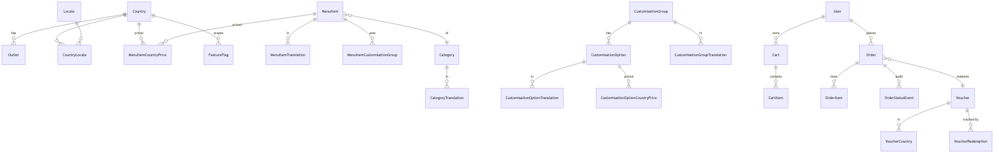
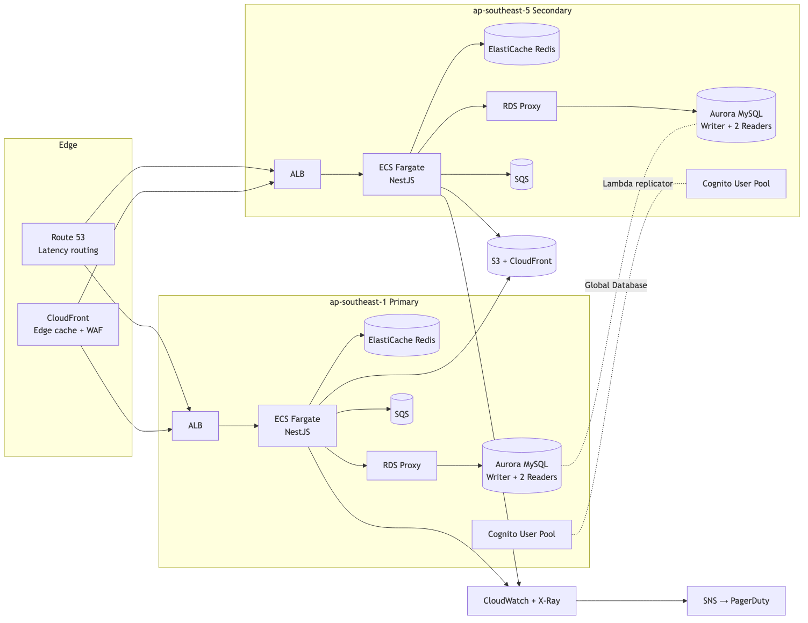

# Baskbear Coffee — Mobile App Redesign

> **Loob Holding Sdn Bhd — Lead Full Stack Developer Assessment**
> Candidate: Chris Cheng · Submission: May 2026

A cross-platform mobile app redesign for **Baskbear Coffee**, delivered as a Flutter app backed by a NestJS + MySQL API, with an AWS multi-region deployment blueprint.

---

## App Overview

Baskbear Coffee operates across Malaysia and Thailand and serves millions of customers. This submission reimagines its mobile ordering experience around four pillars: **fast browsing**, **frictionless ordering**, **local relevance** (currency, language, tax, outlets), and **trustworthy promotions** (voucher rules customers can predict).

| Module        | What ships                                                                                              |
| ------------- | ------------------------------------------------------------------------------------------------------- |
| Menu          | ✅ Full — category browsing, multi-language, country pricing, customisation, dietary tags               |
| Ordering      | ✅ Full — cart, checkout, idempotent placement, history, status timeline, peak-load design              |
| Vouchers      | ✅ Listing, validation API, redemption wired through checkout (with a non-stackable policy, justified)  |
| Multi-Country | ✅ Onboarding picker, country-aware pricing, in-session country switcher                                |

Per the assessment brief, depth is prioritised on Menu + Ordering (where engineering trade-offs are most interesting). Vouchers and Multi-Country are functional but lighter on UX polish. The README and [`docs/architecture.md`](docs/architecture.md) carry Lead-level signal across all four.

---

## Tech Stack

| Layer            | Technology                                          | Justification (short — long form in `docs/architecture.md`)                                                                                |
| ---------------- | --------------------------------------------------- | ------------------------------------------------------------------------------------------------------------------------------------------- |
| Frontend         | Flutter 3.38 + Riverpod 2 + go_router               | Single codebase iOS+Android+Web; Riverpod's compile-safe DI fits a feature-modularised codebase; go_router gives deep-linkable URLs.       |
| Backend          | NestJS 10 (TypeScript) + Prisma + Zod               | Modular DI / decorators give a clean architectural showcase; Prisma keeps the schema as code; Zod adds runtime input validation.            |
| Database         | MySQL 8 (Aurora MySQL in prod)                      | Required. Aurora gives multi-region read replicas + Global Database for cross-region failover.                                              |
| Auth             | AWS Cognito (User Pools, Hosted UI)                 | Hosted UI removes auth UI work; MFA + social-login ready; JWT verified by API via JWKS; fits the AWS theme. Dev bypass for local review.    |
| Cloud            | AWS — ECS Fargate, Aurora, ElastiCache, S3+CloudFront | See [`docs/architecture.md` §5](docs/architecture.md#section-5--aws-architecture--scalability).                                            |
| Version Control  | GitHub                                              | This repo (`baskbear-assessment`).                                                                                                          |

---

## Repository Structure

```
baskbear-assessment/
├── README.md                       ← you are here
├── docker-compose.yml              ← local MySQL 8 + Redis (one command)
├── docs/
│   ├── architecture.md             ← Q&A long-form, ERD + AWS deep dive
│   ├── aws-architecture.png        ← rendered topology
│   ├── aws-architecture.mmd        ← Mermaid source
│   ├── erd.png                     ← rendered ER diagram
│   └── erd.mmd                     ← Mermaid source
├── apps/
│   ├── api/                        ← NestJS API + Prisma
│   │   ├── prisma/                 ← schema, migrations, seed
│   │   ├── src/                    ← feature-modular Nest code
│   │   ├── .env.example
│   │   └── package.json
│   └── mobile/                     ← Flutter app (iOS/Android/web)
│       ├── lib/                    ← feature-modular Dart code
│       ├── test/                   ← unit + widget tests
│       ├── .env.example
│       └── pubspec.yaml
├── db/sql/                         ← raw SQL export of the Prisma migration
└── .github/workflows/              ← api-ci.yml + mobile-ci.yml
```

---

## Local Setup

### Prerequisites

- Flutter 3.38+ (tested on 3.38.3)
- Node.js 20+ (Node 25 tested)
- Docker / OrbStack (for MySQL via the included `docker-compose.yml`)
- Xcode (iOS sim) or Android Studio (emulator) or Chrome (web)

### 1. Start MySQL

```bash
docker compose up -d                     # exposes MySQL 8 on :3307, Redis on :6379
```

The bundled compose file uses known credentials (`baskbear:baskbear@localhost:3307/baskbear`) so the `.env.example` "just works".

### 2. Backend (apps/api)

```bash
cd apps/api
cp .env.example .env                     # tweak only if you skipped docker compose
npm install
npx prisma migrate deploy
npm run seed                             # populates MY + TH menus, 4 outlets, 3 vouchers
npm run start:dev                        # http://localhost:3000
```

Smoke checks:

```bash
curl http://localhost:3000/health
curl -H "X-Country: MY" http://localhost:3000/v1/menu | jq '.[0]'
curl -H "X-Country: TH" http://localhost:3000/v1/menu | jq '.[0]'
```

A demo user `demo@baskbear.test` is seeded. In dev (`DEV_AUTH_BYPASS=true`, the default in the example env) the API accepts `Authorization: Bearer dev:demo-user-sub` instead of validating against Cognito's JWKS — so reviewers don't need AWS credentials.

### 3. Mobile (apps/mobile)

```bash
cd apps/mobile
cp .env.example .env
flutter pub get
flutter run                              # picks the first available device
```

The Flutter code targets **iOS, Android, and Chrome**. Pick whichever device works for you:

- `flutter run -d chrome --web-port 5050` — fastest first run, no toolchain setup beyond Chrome.
- `flutter run -d <ios-sim-udid>` — when you have an iOS Simulator runtime matching your installed Xcode SDK.
- `flutter run -d <android-emu-name>` — Android emulator (use `API_BASE_URL=http://10.0.2.2:3000` in `.env`).

### 4. Tests

```bash
cd apps/api && npm test                  # 8 unit tests covering pricing + voucher rules
cd apps/mobile && flutter test           # 4 unit tests covering money formatter + DTO parsing
```

CI runs the same on every push (`.github/workflows/api-ci.yml`, `mobile-ci.yml`).

---

## Design & Architecture Decisions (Q1 → Q6)

Full answers, with code references, live in
[`docs/architecture.md`](docs/architecture.md). Summary:

- **Q1 Design philosophy** — three principles: fastest path to reordering is sacred; pricing/promotions must be predictable; local feel beats global feel. See [§3 Q1](docs/architecture.md#q1-why-did-you-design-the-app-this-way-walk-us-through-your-design-philosophy).
- **Q2 Multi-country UX** — country is a first-class data axis (pricing tables, locale-scoped UI, currency-driven formatting). [§3 Q2](docs/architecture.md#q2-how-did-you-approach-multi-country-ux).
- **Q3 Beyond-minimum** — country-aware feature flags + order idempotency keys (both production safety features). [§3 Q3](docs/architecture.md#q3-optional-what-additional-features-did-you-build-beyond-the-four-required-modules-and-why).
- **Q4 Riverpod 2** — compile-safe DI, less ceremony than BLoC, defensible at code review. [§3b Q4](docs/architecture.md#q4-which-state-management-solution-did-you-choose-and-why).
- **Q5 Folder structure** — `core/` → `data/` → `features/` with strict directional imports. [§3b Q5](docs/architecture.md#q5-how-did-you-structure-your-flutter-project).
- **Q6 Offline / slow connectivity** — stale-while-revalidate on reads, idempotency on the one write that must survive retries, loud failures on others. [§3b Q6](docs/architecture.md#q6-how-does-your-app-handle-offline-scenarios-or-slow-connectivity).

## Database Design (Q7 → Q10)

- **Q7 Schema walkthrough** — menu with country pricing, orders with snapshot fields, vouchers with redemption rules. See [§4 Q7](docs/architecture.md#q7-walk-us-through-your-core-schema-menu-orders-vouchers).
- **Q8 Multi-country data** — countries / locales reference tables, side tables for everything country-variant, denormalised `countryId` on orders/carts for query locality. [§4 Q8](docs/architecture.md#q8-how-does-your-schema-handle-multi-country-data).
- **Q9 Indexes** — composite indexes on the hot paths (menu reads, order history, voucher redemption checks). [§4 Q9](docs/architecture.md#q9-what-indexing-strategy-did-you-apply).
- **Q10 Zero-downtime migrations** — expand-then-contract pattern, never destructive in the same deploy. [§4 Q10](docs/architecture.md#q10-how-would-you-handle-mysql-schema-migrations-safely-in-a-live-system-with-no-downtime).

ER diagram: 

## AWS Architecture (Q11 → Q17)

- **Q11 Topology** — Route 53 latency routing → CloudFront → regional ALB → ECS Fargate → Aurora MySQL (Global Database) + ElastiCache + SQS. [§5 Q11](docs/architecture.md#q11-overall-aws-architecture).
- **Q12 Multi-region HA** — two active regions, Aurora Global Database, Cognito replication via Lambda, Route 53 health probes. [§5 Q12](docs/architecture.md#q12-high-availability-across-multiple-regions).
- **Q13 Flash-sale (10× in <5min)** — pre-warm ECS + CloudFront, SQS as shock absorber, Redis token-bucket rate limit, feature-flagged degradations. [§5 Q13](docs/architecture.md#q13-scale-the-ordering-service-for-a-flash-sale-10-normal-load-in-5-minutes).
- **Q14 Caching** — three tiers: CloudFront edge, ElastiCache Redis intra-region, in-process for tiny reference data. [§5 Q14](docs/architecture.md#q14-caching-strategy).
- **Q15 Media at scale** — S3 origins (per region, replicated) + CloudFront + Lambda@Edge for on-the-fly resize. [§5 Q15](docs/architecture.md#q15-image-and-media-assets-at-scale-across-countries).
- **Q16 Monitoring** — CloudWatch logs/metrics, X-Ray traces, Synthetics canaries, SNS → PagerDuty alarms. [§5 Q16](docs/architecture.md#q16-production-monitoring).
- **Q17 CI/CD** — GitHub Actions lint+test+scan → ECR → manual gate → blue/green ECS deploy with auto-rollback. [§5 Q17](docs/architecture.md#q17-cicd-pipeline).

AWS topology: 

## CI/CD

Two workflows:

- [`.github/workflows/api-ci.yml`](.github/workflows/api-ci.yml) — boots MySQL service, type-checks, runs `prisma validate`, applies migrations, seeds, runs Jest. ~2 min.
- [`.github/workflows/mobile-ci.yml`](.github/workflows/mobile-ci.yml) — Flutter analyze, test, debug APK build. ~3 min.

Deployment (ECR push → ECS blue/green via CodeDeploy) is described in
[§5 Q17](docs/architecture.md#q17-cicd-pipeline) but not wired into CI — the brief explicitly says "you do not need to provision live AWS infrastructure", so the workflow stops at the artifact stage.

---

## Known Limitations & What I Would Improve

- **Cognito Hosted UI**: signing in via the real Hosted UI requires an AWS
  user pool — the API ships with a `DEV_AUTH_BYPASS` flag so reviewers
  don't need AWS credentials. With more time I'd add a local Cognito stub
  (LocalStack Pro / `mockcognito`) so the full sign-in flow can be
  exercised offline.
- **iOS simulator runtime on Xcode 26.4**: this codebase builds and ships
  for iOS, but the local machine's Xcode 26.4 needs the iOS 26.4 simulator
  runtime installed to launch (not currently present). The Flutter UI runs
  identically on Chrome and Android — `flutter run -d chrome` is the
  smoothest reviewer path on a fresh machine.
- **Push notifications**: order-status updates are pulled (refresh on
  screen open). FCM / APNs push integration is described in
  [§5 Q11](docs/architecture.md#q11-overall-aws-architecture) but not
  implemented — would land via SQS → Lambda → FCM in the next sprint.
- **Kitchen / POS integration**: the order pipeline ends at "PENDING".
  Real outlet integration would consume the SQS order-events stream.
- **Payments**: out of scope per brief; current flow places orders with
  total but doesn't capture payment. Stripe / Razer integration is a
  one-evening task once secrets land.
- **Localised content**: 3 locales (en, ms, th) seeded for every menu
  entity. Translations are professional-grade for the English copy and
  best-effort for ms/th — a localisation pass with native speakers is the
  obvious next step.
- **Riverpod codegen**: I attempted `riverpod_generator` but it conflicts
  with Riverpod 3 on the current Dart SDK. Manual provider syntax is used
  throughout — preserves testability without the codegen step.
