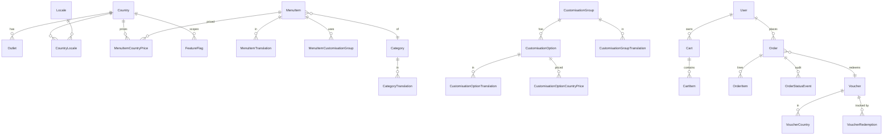

# Architecture diagrams — Baskbear Coffee Mobile App

Loob Holding Lead Full Stack Developer Assessment · Chris Cheng · 2026-05

> The full written answers to all 17 assessment questions (Design & UX,
> Database Design, AWS Architecture) now live in the top-level
> [README](../README.md). This file holds the rendered diagrams the README
> references.

---

## ER diagram

Mermaid source: [`erd.mmd`](erd.mmd) · PNG export: [`erd.png`](erd.png).



---

## AWS topology diagram

Mermaid source: [`aws-architecture.mmd`](aws-architecture.mmd) · PNG export:
[`aws-architecture.png`](aws-architecture.png). Rationale and the answers to
Q11–Q17 are in [README §5](../README.md#5-aws-architecture--scalability).

```mermaid
flowchart LR
  subgraph Edge
    R53[Route 53\nLatency routing]
    CF[CloudFront\nEdge cache + WAF]
  end
  subgraph ap-southeast-1 (Primary)
    ALB1[ALB] --> ECS1[ECS Fargate\nNestJS]
    ECS1 --> Redis1[(ElastiCache Redis)]
    ECS1 --> Proxy1[RDS Proxy]
    Proxy1 --> Aurora1[(Aurora MySQL\nWriter + 2 Readers)]
    ECS1 --> SQS1[(SQS)]
    Cog1[Cognito User Pool]
  end
  subgraph ap-southeast-5 (Secondary)
    ALB2[ALB] --> ECS2[ECS Fargate\nNestJS]
    ECS2 --> Redis2[(ElastiCache Redis)]
    ECS2 --> Proxy2[RDS Proxy]
    Proxy2 --> Aurora2[(Aurora MySQL\nWriter + 2 Readers)]
    ECS2 --> SQS2[(SQS)]
    Cog2[Cognito User Pool]
  end
  R53 --> ALB1
  R53 --> ALB2
  CF --> ALB1
  CF --> ALB2
  Aurora1 -. Global Database .- Aurora2
  Cog1 -. Lambda replicator .- Cog2
  ECS1 --> S3[(S3 + CloudFront)]
  ECS2 --> S3
  ECS1 --> XR[CloudWatch + X-Ray]
  ECS2 --> XR
  XR --> PD[SNS → PagerDuty]
```

### Client-side external dependencies (AI Barista)

The "AI Barista" feature ([README §3.1 Q3](../README.md#q3-optional-what-additional-features-did-you-build-beyond-the-four-required-modules-and-why))
adds two **direct** mobile→internet calls that bypass the backend entirely — they
are not part of the server topology above:

- **Open-Meteo** (`https://api.open-meteo.com`) — keyless current-weather lookup
  by the selected country's city, to bias recommendations. Best-effort; failure
  is silent.
- **HuggingFace model CDN** — a one-time `flutter_gemma` model download
  (`GEMMA_MODEL_URL`) cached on-device thereafter. Optional; the feature falls
  back to an offline recommender when absent.

Everything else (menu, cart, orders, vouchers) still flows through the API. In a
production build these third-party calls would ideally be proxied/whitelisted via
the app's egress policy rather than hit directly.
