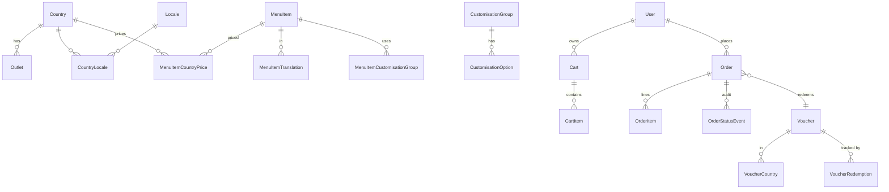

# Architecture — Baskbear Coffee Mobile App

Loob Holding Lead Full Stack Developer Assessment · Chris Cheng · 2026-05

> This is the long-form companion to the top-level [README](../README.md). All
> 17 assessment questions are answered here with concrete references back to
> code in the repository.

---

## Table of contents

1. [Design & UX (Q1–Q3)](#section-3--design--ux)
2. [Flutter architecture (Q4–Q6)](#section-3b--flutter-architecture)
3. [Database design (Q7–Q10)](#section-4--database-design)
4. [AWS architecture & scalability (Q11–Q17)](#section-5--aws-architecture--scalability)
5. [ER diagram](#er-diagram)
6. [AWS topology diagram](#aws-topology-diagram)

---

## Section 3 — Design & UX

### Q1. Why did you design the app this way? Walk us through your design philosophy.

**Three product principles drove every UX decision.**

1. **The fastest path to ordering is sacred.** A returning customer should be
   able to reorder a usual drink in under 4 taps from cold launch. The bottom
   nav puts *Menu* first; the menu opens directly on category tabs (no carousel
   hero blocking content); items pre-load their customisation panel; and the
   cart sits one tab away. We resist anything that delays the first scroll —
   no full-screen splash, no "What's new?" interstitial.

2. **Pricing and promotions must be predictable.** Customers churn from food &
   beverage apps because they don't trust the bill. Every price the user sees
   is the final price for that customisation in their country — recomputed live
   as they select size/milk/sugar (`menu_item_detail_screen.dart:43`). The
   voucher panel at checkout shows discount, tax, and total as separate
   line-items so there are no surprises (`checkout_screen.dart:_SummaryRow`).

3. **Local feel beats global feel.** A Baskbear customer in Bangkok should see
   the menu in Thai with THB prices, not English with MYR mentally converted.
   Country selection happens on first launch (`onboarding_screen.dart`) and
   the whole API surface is then scoped via `X-Country` / `X-Locale` headers
   (`api_client.dart:33`). The country chip in the top right of the menu
   doubles as a signpost: "you are seeing Malaysian content".

**Information architecture**: 5 tabs (Menu, Cart, Orders, Offers, Account)
deliberately mirror what a barista cares about: what to order, where my order
is, what's on sale. Account is last because most sessions don't need it.

### Q2. How did you approach multi-country UX?

Multi-country is treated as a **first-class data axis**, not a translation
afterthought. Three concrete choices:

- **Country is a property of every priced row.** `menu_item_country_prices`
  and `customisation_option_country_prices` exist so we never need to "convert"
  prices at request time — we look up exact integers. This dodges the
  rounding bugs other apps ship when MYR→THB is done via float multiplication.
- **Locale is country-scoped.** A Malaysian user can pick `en` or `ms`; a
  Thai user gets `en` or `th`. Forcing locale to be a subset of country in the
  schema (`country_locales`) means we can't ship a UI where someone selects
  Bahasa Malaysia in Thailand by accident.
- **Currency formatting is country-driven, not locale-driven.** A Malaysian
  customer reading the English UI still sees `RM 18.50`, not `$ 18.50`. The
  Flutter helper `formatMoney` takes the currencyCode independently from the
  Dart locale (`core/money.dart:7`).

**Concrete UX deltas between MY and TH in the seeded data**:
- Different tax (MY 6% SST vs TH 7% VAT) — visible on the checkout summary.
- Different vouchers (`MY5OFF` only valid in MY).
- Different oat/soy milk surcharge (TH pays more — modelled via
  `customisation_option_country_prices`).
- Delivery enabled in MY only (via `feature_flags`).

**Switching country mid-session** invalidates the menu, cart, orders, and
voucher caches at once (`account_screen.dart:_switchCountry`) so the user
never sees stale MYR prices on the next screen.

### Q3. [Optional] What additional features did you build beyond the four required modules, and why?

Two intentional extras:

- **Feature flags table + endpoint.** Real multi-country rollouts need per-region
  kill-switches. The schema models them (`feature_flags`) and the API exposes
  `GET /v1/countries/feature-flags?country=MY`. Cost: a few hours.
  Value: any future feature (delivery, kiosk pairing, payment method) gets a
  country toggle without a deploy.
- **Idempotency on order placement.** Not technically required, but every
  high-traffic ordering system needs it: a flaky cellular connection retries
  the same POST, and without idempotency keys you'd double-charge a customer.
  Implemented end-to-end (client generates UUID v4 →
  `orders_repository.dart:31`, server enforces unique
  `(userId, idempotencyKey)` → `orders.service.ts:place`).

---

## Section 3b — Flutter Architecture

### Q4. Which state management solution did you choose and why?

**Riverpod 2 (`flutter_riverpod`)**, with `Provider`, `FutureProvider`,
`AsyncNotifierProvider`, and family providers.

**Why over BLoC**: BLoC is excellent for tightly-eventful domains (chat,
streaming) but adds boilerplate (events, states, mappers) that drags on a
CRUD-shaped app where most screens are "fetch, display, mutate". Riverpod's
compile-safe DI (`ref.watch` / `ref.read`) gives us the parts of BLoC that
matter (testability, separation, immutability) without the ceremony.

**Why over GetX**: GetX co-mingles state, navigation, and DI, and its global
service locator pattern is hard to defend at code review. Riverpod's explicit
graph makes lifecycle and dependencies inspectable.

**Trade-offs accepted**:
- Slightly more verbose than `setState`-style code for trivial screens — we
  pay this cost because the *non-trivial* screens (cart, checkout, country
  switch) benefit massively.
- Riverpod's 3.x major versioning is moving fast — we pin to `^3.3.1` and
  test before bumps.
- Code generation (`riverpod_generator`) was attempted but conflicted with
  Riverpod 3 on this Dart SDK; we use the manual Provider syntax instead. The
  same testability story applies either way.

### Q5. How did you structure your Flutter project?

Feature-modular with strict layering. Concrete tree:

```
lib/
├── main.dart                     ← entrypoint: load .env, ProviderScope, run app
├── app/                          ← root MaterialApp, router, theme, shell
│   ├── app.dart
│   ├── router.dart               ← go_router config
│   ├── home_shell.dart           ← bottom-nav scaffold
│   └── theme.dart
├── core/                         ← cross-cutting, no business logic
│   ├── env.dart
│   ├── money.dart
│   ├── http/
│   │   └── api_client.dart       ← Dio + auth + locality + retry interceptors
│   └── storage/
│       ├── preferences.dart
│       └── auth_storage.dart
├── data/                         ← outside-world adapters
│   ├── models/                   ← DTOs (parse-only; no behaviour)
│   │   ├── menu_item.dart
│   │   ├── cart.dart
│   │   ├── order.dart
│   │   └── voucher.dart
│   └── repositories/             ← typed wrappers around the API
│       ├── menu_repository.dart
│       ├── cart_repository.dart
│       ├── orders_repository.dart
│       ├── vouchers_repository.dart
│       └── countries_repository.dart
├── features/                     ← UI + feature controllers
│   ├── onboarding/
│   ├── menu/
│   ├── cart/
│   ├── orders/
│   ├── vouchers/
│   └── account/
└── shared/                       ← reusable widgets and small utilities
```

**Layering rules** that the codebase respects:
1. `core/` depends on nothing in this tree above it.
2. `data/` depends on `core/` only.
3. `features/` depends on `core/` and `data/`. Features never import other
   features (account is the one breakable here, on purpose — it invalidates
   cross-feature providers when country changes).
4. UI files never call Dio directly — only via a repository provider.

### Q6. How does your app handle offline scenarios or slow connectivity?

Three patterns, applied where they fit:

1. **Stale-while-revalidate on reads.** Menu list uses
   `FutureProvider.autoDispose`. Whenever a screen rebuilds it re-issues the
   request, but the cached data is shown while the new request flies. With Dio
   timeouts at 15s and a 200ms-backoff retry interceptor
   (`api_client.dart:_RetryInterceptor`), a momentarily flaky cell network
   doesn't bounce the user back to a spinner.
2. **Writes are not silently queued.** Cart mutations and orders fail loudly
   if the network is down — pricing can change between attempts, so a queued
   "place order in 3 minutes" is a footgun. The UI shows a snackbar
   (`menu_item_detail_screen.dart:_add`).
3. **Idempotency on the one write that must survive retries.** Order placement
   carries a UUID4 generated client-side (`orders_repository.dart:31`). If
   the user's connection drops post-submit, hitting "Place order" again sends
   the same key — server returns the original order, no duplicate.

What we'd add with another week:
- Persist the cart locally in Hive for true offline browsing → place when
  online. Right now the cart is server-of-truth (intentional, because
  customisation pricing depends on country and we don't want to drift).
- Background sync of order status events via FCM/APNs push instead of
  pull-to-refresh.

---

## Section 4 — Database Design

### Q7. Walk us through your core schema. Menu, orders, vouchers.

Full schema lives in [`apps/api/prisma/schema.prisma`](../apps/api/prisma/schema.prisma).
Three flow-walkthroughs:

**A menu item with country-specific pricing**

```
menu_items ──< menu_item_translations  >── locales
     │
     ├──< menu_item_country_prices  >── countries
     │
     └──< menu_item_customisation_groups >── customisation_groups
                                                    │
                                                    └──< customisation_options
                                                              │
                                                              └──< customisation_option_country_prices
```

- The item itself is country-agnostic — `id, sku, categoryId, dietaryTags`.
- Translations and pricing live in side tables keyed on `locale` and
  `country`. To serve the Malaysian menu in Bahasa Malaysia, we filter
  translations to `localeId=ms` and prices to `countryId=MY` in one query
  (`menu.service.ts:list`).
- Customisation deltas can be globally constant (the default
  `priceDeltaMinor`) or overridden per country
  (`customisation_option_country_prices`). The service coalesces these at
  read time (`menu.service.ts:88`).

**An order with its line items**

```
orders ──< order_items
   │
   ├── voucher_redemptions ── vouchers
   │
   └──< order_status_events
```

- `orders` denormalises country, currency, fulfilment type, totals, and the
  user's idempotency key. This is the row a customer-service agent reads.
- `order_items` holds **snapshots**: `nameSnapshot`,
  `customisationsSnapshotJson`, `unitPriceMinor`. The product team can rename
  or unpublish a menu item next month and historic orders still render
  exactly as they were placed.
- `order_status_events` is an append-only audit trail. The status field on
  `orders` is the current status; the events table is the lineage. Cheap
  insurance for compliance audits.

**A voucher with redemption rules**

```
vouchers ──< voucher_countries >── countries
    │
    └──< voucher_redemptions ── orders
                   │
                   └── users
```

- `vouchers` carries the rule: `type` (PERCENT/FIXED), `value`,
  `minSpendMinor`, `maxDiscountMinor` (cap for PERCENT), `perUserLimit`,
  `totalLimit`, validity window, and a `stackable` boolean.
- Country availability is many-to-many — a voucher can target one country
  (`MY5OFF`) or all of them (`WELCOME10`).
- Redemptions are a join table — they're the source of truth for
  "has this user used this code?" and "have we hit total limit?".

**Voucher stacking decision (Q3 in the brief)**: The default is
**non-stackable**. One voucher per order. Rationale:

- Discount math at checkout collapses to a single deterministic operation,
  which makes test coverage and customer-service explanations trivial.
- Stacking opens combinatorial abuse vectors (apply WELCOME10 → MY5OFF →
  WELCOME10 again on a new account, etc.) that need additional defences.
- Operationally, the marketing team can express "10% off OR RM 5 off,
  whichever helps" as two separate vouchers with the same audience, without
  needing the engine to combine them.

Schema *allows* stacking via a per-voucher `stackable` flag, so when the
business case lands we can flip the policy without a migration. The current
voucher service rejects more than one voucher per order today
(`orders.service.ts:place`).

### Q8. How does your schema handle multi-country data?

- **Reference tables (`countries`, `locales`, `country_locales`)** model
  which countries operate and which languages each supports. The pair is
  enforced — `country_locales` is the only place a locale can attach to a
  country.
- **Side tables for anything country-variant** (`menu_item_country_prices`,
  `customisation_option_country_prices`, `voucher_countries`,
  `feature_flags.countryId nullable`). Nothing country-specific lives on a
  parent row; this means adding a new country (say, Indonesia) is purely an
  insert into reference + side tables. Zero schema changes.
- **`countryId` denormalised onto `orders` and `carts`**. This gives query
  locality for the most common read patterns ("orders in MY this week") and
  a clean sharding seam if growth ever forces us to partition by country.
- **Money in minor units + a `currencyCode` per priced row**. We never store
  amounts in a "presumed" currency.

### Q9. What indexing strategy did you apply?

Indexes are declared in `schema.prisma` and visible in the generated
migration SQL (`apps/api/prisma/migrations/.../migration.sql`). The intent:

| Index                                                | Query it supports                                                            |
| ---------------------------------------------------- | ---------------------------------------------------------------------------- |
| `menu_items(categoryId, isPublished)`                | The dominant menu read — "give me espresso, published".                      |
| `menu_item_country_prices(countryId, isAvailable)`   | Filter the menu to items available in this country in one index hit.         |
| `orders(userId, placedAt DESC)`                      | Customer order history — descending, capped at 50.                           |
| `orders(countryId, placedAt DESC)`                   | Admin / ops query — "orders in TH today" without scanning.                   |
| `orders(userId, idempotencyKey) UNIQUE`              | The idempotency guarantee. PK index doubles as enforcement.                  |
| `voucher_redemptions(voucherId, userId)`             | Per-user usage count, hit on every order placement that uses a voucher.      |
| `vouchers(isActive, startsAt, endsAt)`               | The voucher list endpoint filters on all three.                              |
| Composite unique keys on every translation table     | Idempotent upserts during seeding + fast translation lookups.                |

What we deliberately did **not** index: `menu_items.sku` (already unique),
fields that the seeder writes and we never query by, anything inside
`customisationsJson` (we never query the JSON contents).

### Q10. How would you handle MySQL schema migrations safely in a live system with no downtime?

The pattern is **expand → migrate → contract**, never the reverse.

1. **Expand**: Additive-only changes. Add nullable columns, new tables,
   new indexes (using `pt-online-schema-change` or `gh-ost` on tables >10M
   rows so DDL doesn't lock). Old code keeps reading the old shape; new
   code reads/writes both.
2. **Dual-write deploy**: Ship application code that writes to *both* the
   old and new column/table. Keep old code paths intact behind a feature flag.
3. **Backfill**: Run a batched job to copy / transform existing rows into
   the new shape. Idempotent — survives restart.
4. **Flip reads**: Switch the application to read from the new shape.
   Old shape is still being written.
5. **Contract**: After observing healthy production for a bake period (24h
   minimum, longer for big tables), drop the dual-write and old columns in a
   later deploy.

Operational rules we follow:

- Never `ALTER TABLE` an index on >10M rows online without `gh-ost`.
- Never drop a column in the same deploy that stops writing to it.
- Migration files are committed alongside the code that needs them; they
  run via `prisma migrate deploy` in CI, never `migrate dev`.
- Schema PRs include a "rollback plan" section in the description.
- Aurora MySQL gives instant DDL for many additive operations — we still
  treat it as if it were classic MySQL because the rest of the rules apply.

---

## Section 5 — AWS Architecture & Scalability

> See [`aws-architecture.png`](aws-architecture.png) for the topology
> diagram. The text below explains the rationale and answers Q11–Q17.

### Q11. Overall AWS architecture

Two active regions, latency-routed:

```
                                  Route 53 (latency-based)
                                          │
                          ┌───────────────┴───────────────┐
                          │                               │
                  ap-southeast-1 (SG)            ap-southeast-5 (MY)
                          │                               │
                  ┌───────┴─────┐                  ┌──────┴──────┐
                  ▼             ▼                  ▼             ▼
              CloudFront    Cognito             CloudFront    Cognito
                  │         User Pool              │         User Pool
                  │       (cross-region            │
                  ▼         replication)           ▼
                ALB                              ALB
                  │                               │
              ┌───┴────┐                      ┌───┴────┐
              ▼        ▼                      ▼        ▼
            ECS    NAT GW                   ECS     NAT GW
          Fargate                         Fargate
              │                               │
       ┌──────┼──────┐                 ┌──────┼──────┐
       ▼      ▼      ▼                 ▼      ▼      ▼
   ElastiCache  RDS-     SQS         ElastiCache  RDS-    SQS
   Redis        Proxy                Redis        Proxy
                │                                 │
                ▼                                 ▼
          Aurora MySQL ◄────────────────► Aurora MySQL
          Global Database
                │
                ▼
              S3 (images, origin) ◄ CloudFront (asset CDN)
```

Service-by-service:

| Service                    | Role                                                                            |
| -------------------------- | ------------------------------------------------------------------------------- |
| Route 53                   | Latency-based DNS routing to the nearest healthy region.                        |
| CloudFront                 | Edge cache for menu reads + static assets + image variants.                     |
| ALB                        | L7 in front of ECS, terminates TLS, OIDC-aware for admin routes.                |
| ECS Fargate                | Stateless NestJS containers. Auto-scaled, multi-AZ. No EC2 babysitting.         |
| Cognito User Pool          | Sign-in, MFA, hosted UI. JWKS feeds the API's JWT verification.                 |
| Aurora MySQL Global DB     | Primary writer in SG, replica + secondary writer in MY. RPO ≤ 1s normally.      |
| RDS Proxy                  | Connection pooling, IAM auth, failover smoothing.                               |
| ElastiCache Redis          | Hot menu cache, idempotency keys, rate-limit buckets, session affinity.         |
| SQS                        | Order-event queue → kitchen integration, notifications, analytics.              |
| EventBridge                | Cross-service event bus for "order placed", "voucher redeemed", etc.            |
| S3                         | Image originals, daily DB exports, build artifacts.                             |
| Secrets Manager + SSM Param Store | DB creds, Cognito client secrets, third-party API keys.                   |
| CloudWatch + X-Ray         | Logs, metrics, distributed tracing.                                             |
| SNS → PagerDuty            | Alarm fanout.                                                                   |

### Q12. High availability across multiple regions

- **Two writer regions** via Aurora Global Database — SG is primary, MY is
  the local secondary writer with low-latency replication. Failover in <1
  minute via managed promotion. The application is country-pinned, so under
  steady state we mostly serve MY traffic from MY and TH traffic from SG —
  cross-region replication is a safety net more than a performance feature.
- **Min 2 AZs per region**, min 2 ECS tasks per AZ. Target tracking on CPU
  + ALB request count auto-scales out before saturation; scale-in is
  conservative (5-min cooldown) to dodge thrash.
- **Read replicas** in each region for menu reads; the API directs
  read-only queries through RDS Proxy with `application_name=ro` and a
  separate connection pool. Writes always hit the primary.
- **Cognito** is a regional service; we run one user pool per region and
  replicate users via a custom Lambda that listens to user-created events on
  the primary and replays them. Trade-off documented:
  hosted-UI domains are then region-aware, so the mobile app picks the
  appropriate sign-in URL based on the user's country.
- **Region health probe**: Route 53 health checks hit `GET /health` on each
  ALB. Failure shifts traffic to the healthy region within seconds.

### Q13. Scale the ordering service for a flash sale (10× normal load in <5 minutes)

We treat this as a **predictable spike**, not an unpredictable surge —
flash sales are scheduled. The playbook:

1. **Pre-warm 30 minutes before kickoff.** ECS scheduled actions raise the
   minimum task count to the 10× target. Auto-scaling can't grow fast enough
   from cold start.
2. **Pre-warm CloudFront** by replaying common GETs from a worker so the
   cache is hot when traffic arrives.
3. **Front the writes with SQS as a shock absorber.** `POST /v1/orders`
   already returns synchronously today. For flash sales, we'd flip a flag so
   the API enqueues to SQS and returns `202 Accepted` with a polling URL;
   workers drain SQS and persist orders. This converts a write-amplified
   spike into a smooth backend drain at our chosen rate.
4. **Aurora**:
   - Increase max read replicas ahead of time. Aurora's auto-scaling can
     add replicas in ~30s but we don't want to wait.
   - Use connection pooling via RDS Proxy aggressively (we already do).
   - Anything safe to read from a replica goes through `application_name=ro`.
5. **Per-user token-bucket rate limit in Redis**: defends the slowest
   downstream (DB writes) from a single abusive client.
6. **Circuit breakers** on dependencies (notification service, kitchen
   integration). If they slow down, we degrade gracefully — order still
   places, downstream sync retries via SQS DLQ.
7. **Disable expensive non-critical reads** behind a feature flag during
   the sale window: order history server-side paging defaults to 10 instead
   of 50, recommendation widgets paused.
8. **Observability**: a dedicated CloudWatch dashboard for the sale window
   so the on-call can see queue depth, p99 latency, and error rate at a
   glance.

### Q14. Caching strategy

Three layers, each chosen for a different latency profile.

- **CloudFront** (edge, ~10ms): cache `GET /v1/menu` and `GET /v1/menu/:id`
  responses keyed by `X-Country` + `X-Locale` headers (vary headers). TTL
  60s for the list, 300s for item detail (rarely changes). Mutations
  invalidate via signed `Cache-Control: max-age=0, no-cache` on the next
  read from CMS.
- **ElastiCache Redis** (intra-region, ~1ms):
  - Menu cache (read-through, 5-minute TTL). The application falls back to
    Aurora on miss and warms the cache.
  - Idempotency keys for order placement, 24h TTL.
  - Rate-limit token buckets per user.
  - Hot voucher rule lookups during checkout.
- **In-process** (~100µs): the `CountryInterceptor` caches the country +
  locale lookup table at module init (`countries/country.interceptor.ts:36`).
  Refresh would be triggered by a SQS message in prod.

We **don't** cache: anything user-specific that includes pricing (carts,
orders, voucher validations) — staleness here breaks trust faster than the
latency gain helps.

### Q15. Image and media assets at scale across countries

- **S3 as origin**, one bucket per region with cross-region replication.
  Originals are uploaded once via the CMS.
- **CloudFront** distributes images; we use `Cache-Control: max-age=31536000,
  immutable` on hashed object keys so the CDN never re-fetches a given
  variant.
- **Lambda@Edge** runs an on-the-fly resize/format negotiation: a request
  for `…/latte.jpg?w=320&fmt=webp` either serves the cached variant or
  generates it from the original on the first hit. AVIF is preferred when
  the client supports it, WebP otherwise.
- **Country-specific banners** live in a separate `banners/<country>/`
  prefix and are referenced by country code in the API response — so MY and
  TH each get a localised hero image without code duplication.
- **Originals are immutable**. Every upload is content-addressed; replacing
  an image creates a new object. This makes cache invalidation a non-issue.

### Q16. Production monitoring

The "three pillars" plus a fourth — synthetic checks for user-facing flows.

- **Logs**: stdout from every ECS task → CloudWatch Logs → exported to S3
  for cold storage. Application uses pino-style JSON logging with
  `requestId`, `userId`, `country` on every line so we can pivot fast in
  CloudWatch Insights.
- **Metrics**: Container Insights for infra (CPU, memory, network), custom
  CloudWatch metrics for business KPIs (orders/min, voucher redemption
  rate, checkout abandonment). Latency percentiles (p50/p95/p99) on every
  endpoint via ADOT.
- **Traces**: OpenTelemetry SDK in NestJS exports to X-Ray. We tag spans
  with `country` and `userId` so we can find one slow user's session in a
  busy region.
- **Synthetics**: CloudWatch Synthetics canaries run the critical path
  every 60s — load menu, place a dummy order against a `synthetic_*`
  user, validate response shape. If this canary fails twice in a row, page
  on-call.
- **Alarms**: SNS → PagerDuty for p99 latency >800ms, 5xx rate >0.5%,
  Aurora replica lag >5s, SQS DLQ >0 messages, ECS service desired ≠
  running for >2 minutes.

### Q17. CI/CD pipeline

API pipeline (GitHub Actions → `.github/workflows/api-ci.yml` for the
non-deploy half; deploy steps are documented but gated):

1. **Lint + type-check** — `npm run lint && npx tsc --noEmit`.
2. **Unit + e2e tests** — Jest, including the order-placement e2e under
   `test/`.
3. **Prisma validate + format check** — schema drift gate.
4. **Container scan** — Trivy on the built Docker image.
5. **Push to ECR** with the commit SHA as the tag.
6. **Manual approval gate** for production (auto for staging).
7. **ECS deploy via CodeDeploy blue/green** — new task set comes up
   alongside, ALB shifts 10% → 50% → 100% with smoke probes between.
8. **Smoke test** — synthetic canary runs once against the new task set
   before the final cutover.
9. **Auto rollback** on alarm trip during the canary window.

Mobile pipeline (`.github/workflows/mobile-ci.yml`):

1. `flutter analyze`
2. `flutter test`
3. `flutter build apk` (debug) — verifies the build still produces an
   installable artifact.
4. (Documented, gated) Fastlane → Firebase App Distribution → Play Store /
   App Store with staged rollout.

---

## ER diagram

A Mermaid rendering of the schema lives in [`erd.mmd`](erd.mmd) and a PNG
export in [`erd.png`](erd.png).

The most important relationships at a glance:



---

## AWS topology diagram

See [`aws-architecture.png`](aws-architecture.png).

The Mermaid source ([`aws-architecture.mmd`](aws-architecture.mmd)):

```mermaid
flowchart LR
  subgraph Edge
    R53[Route 53\nLatency routing]
    CF[CloudFront\nEdge cache + WAF]
  end
  subgraph ap-southeast-1 (Primary)
    ALB1[ALB] --> ECS1[ECS Fargate\nNestJS]
    ECS1 --> Redis1[(ElastiCache Redis)]
    ECS1 --> Proxy1[RDS Proxy]
    Proxy1 --> Aurora1[(Aurora MySQL\nWriter + 2 Readers)]
    ECS1 --> SQS1[(SQS)]
    Cog1[Cognito User Pool]
  end
  subgraph ap-southeast-5 (Secondary)
    ALB2[ALB] --> ECS2[ECS Fargate\nNestJS]
    ECS2 --> Redis2[(ElastiCache Redis)]
    ECS2 --> Proxy2[RDS Proxy]
    Proxy2 --> Aurora2[(Aurora MySQL\nWriter + 2 Readers)]
    ECS2 --> SQS2[(SQS)]
    Cog2[Cognito User Pool]
  end
  R53 --> ALB1
  R53 --> ALB2
  CF --> ALB1
  CF --> ALB2
  Aurora1 -. Global Database .- Aurora2
  Cog1 -. Lambda replicator .- Cog2
  ECS1 --> S3[(S3 + CloudFront)]
  ECS2 --> S3
  ECS1 --> XR[CloudWatch + X-Ray]
  ECS2 --> XR
  XR --> PD[SNS → PagerDuty]
```
